# 🔄 BearBargain State Flows

**Version 1.0** - Diagrams for critical paths. Use these to implement hooks + reducers. Mermaid for viz (copy to Figma/Markdown viewer).

## 1. Dip Detection Lifecycle (SignalProvider)

The core loop that powers real-time price monitoring and alert generation.


### Key States Explained

| State | Description | Entry Condition | Exit Condition |
|-------|-------------|-----------------|----------------|
| **Idle** | No active connection | App start, max retries | `initWebSocket()` called |
| **Connecting** | WebSocket handshake | `initWebSocket()` | Success or timeout (10s) |
| **Listening** | Active price feed | WS connected | Disconnect or app background |
| **PriceUpdate** | Processing tick | Valid Zod-parsed message | Processed (immediate) |
| **ThresholdMet** | Dip detected | Drop >= user threshold | Alert fired |
| **ActiveAlert** | Alert visible | Animation complete | Timeout (5s) or user action |
| **Error** | Connection lost | WS error event | Retry or give up |

### Implementation Notes

```typescript
// hooks/useDipDetector.ts
type DipState = 
  | 'idle' 
  | 'connecting' 
  | 'listening' 
  | 'alert-active' 
  | 'error';

interface DipDetectorState {
  state: DipState;
  sessionHigh: number;
  currentPrice: number;
  activeAlerts: Alert[];
  retryCount: number;
}

// Hysteresis prevents alert spam
const HYSTERESIS_BUFFER = 0.05; // 5%
const shouldTriggerAlert = (
  currentPrice: number,
  sessionHigh: number,
  threshold: number,
  lastAlertPrice: number | null
) => {
  const dropPercent = (sessionHigh - currentPrice) / sessionHigh;
  if (dropPercent < threshold) return false;
  if (lastAlertPrice && currentPrice > lastAlertPrice * (1 - HYSTERESIS_BUFFER)) {
    return false; // Price hasn't dropped enough since last alert
  }
  return true;
};
```

---

## 2. Offline Queue Resolution (PortfolioProvider)

Handles queued actions when app goes offline and reconnects.


### Queue States

| State | Description | Data Stored | Transition |
|-------|-------------|-------------|------------|
| **QUEUED** | Action waiting | `{action, price, timestamp, symbol}` | Network restore or timeout |
| **PENDING** | Processing | Same + `currentPrice` | Stale check complete |
| **FRESH** | Ready to execute | Same + `priceDelta` | Auto-execute |
| **STALE** | Needs user input | Same + `priceDelta` | User choice |
| **EXPIRED** | Too old | Same | Auto-dismiss |

### Resolution Logic

```typescript
// stores/portfolioStore.ts
interface QueuedAction {
  id: string;
  type: 'DCA_SIM' | 'SELL_SIM';
  symbol: string;
  amount: number;
  priceAtQueue: number;
  timestamp: number;
  status: 'QUEUED' | 'PENDING' | 'STALE' | 'FRESH' | 'EXPIRED';
}

const STALE_THRESHOLD = 0.20; // 20%
const EXPIRY_MS = 60 * 60 * 1000; // 1 hour

const resolveQueuedAction = async (action: QueuedAction): Promise<Resolution> => {
  // Check expiry first
  if (Date.now() - action.timestamp > EXPIRY_MS) {
    return { status: 'EXPIRED', message: 'Bear missed this dip 😴' };
  }
  
  // Fetch current price
  const currentPrice = await fetchPrice(action.symbol);
  const priceDelta = Math.abs(currentPrice - action.priceAtQueue) / action.priceAtQueue;
  
  if (priceDelta <= STALE_THRESHOLD) {
    return { status: 'FRESH', execute: true };
  }
  
  return { 
    status: 'STALE', 
    priceDelta,
    prompt: `Price moved ${(priceDelta * 100).toFixed(1)}%—still DCA?`
  };
};
```

---

## 3. Trade Confirm Flow (TradeConfirmPopup)

Phase 1 simulation flow (no real Schwab integration yet).

```mermaid
stateDiagram-v2
    [*] --> Closed: Default state
    
    Closed --> Open: Dip tap / AI suggest / Manual
    
    Open --> AmountSelect: Show slider ($50-$500)
    AmountSelect --> Projection: User adjusts amount
    
    Projection --> Display: Calculate HODL gains
    note right of Display
      Example: "At $150K BTC, 
      your $100 → $176 (+76%)"
    end note
    
    Display --> Confirm: User taps "Simulate DCA"
    Display --> AmountSelect: User adjusts slider
    
    Confirm --> Validating: Check amount limits
    Validating --> Execute: Valid
    Validating --> Error: Invalid (show inline error)
    Error --> AmountSelect: User fixes
    
    Execute --> Logging: Add to PortfolioProvider
    Logging --> Success: History updated
    Success --> Confetti: 2s animation burst
    Confetti --> Share: Show share option
    Share --> Closed: User dismisses
    
    Open --> Cancel: Back button / Swipe down
    Cancel --> Closed: No action taken
    
    Open --> Timeout: 30s no interaction
    Timeout --> Closed: Auto-dismiss
```



### Popup States

| State | UI Element | User Actions Available |
|-------|------------|----------------------|
| **Closed** | None | N/A |
| **Open** | Modal overlay | Adjust slider, cancel |
| **AmountSelect** | Slider active | Drag, tap presets ($50/$100/$200) |
| **Projection** | Gains calculator | View only |
| **Confirm** | Button pressed | Wait |
| **Success** | Confetti + summary | Share, dismiss |

### Projection Calculator

```typescript
// utils/projections.ts
interface Projection {
  currentPrice: number;
  amount: number;
  targetPrice: number;
  projectedValue: number;
  percentGain: number;
}

const calculateProjection = (
  symbol: string,
  amount: number,
  currentPrice: number
): Projection => {
  // Default targets based on historical patterns
  const targets: Record<string, number> = {
    'IBIT': 150000, // BTC target
    'ETHA': 8000,   // ETH target
    'STCE': 50,     // Thematic target
  };
  
  const targetPrice = targets[symbol] ?? currentPrice * 1.5;
  const shares = amount / currentPrice;
  const projectedValue = shares * targetPrice;
  const percentGain = ((projectedValue - amount) / amount) * 100;
  
  return {
    currentPrice,
    amount,
    targetPrice,
    projectedValue,
    percentGain,
  };
};
```

---

## 4. Chat Streaming State (TradeWhispererChat)

Handles message composition, AI streaming, and action parsing.


### Streaming States

| State | Visual Indicator | Duration |
|-------|------------------|----------|
| **Idle** | Blinking cursor | Until input |
| **Composing** | Active text field | Until submit |
| **Recording** | Pulsing mic icon | Until release |
| **Sending** | Typing indicator (...) | Until first chunk |
| **Streaming** | Words fading in | Until complete |
| **Staggered** | 32ms word delays | Per chunk |

### Chunk Processing

```typescript
// hooks/useTradeWhisperer.ts
interface ChatState {
  status: 'idle' | 'composing' | 'sending' | 'streaming' | 'error';
  chunks: string[];
  displayedWords: number;
  detectedAction: ParsedAction | null;
}

const STAGGER_DELAY_MS = 32;
const MAX_CHUNKS = 12;
const MIN_CHUNKS = 2;

const processStreamChunk = (chunk: string, state: ChatState): ChatState => {
  const newChunks = [...state.chunks, chunk].slice(-MAX_CHUNKS);
  
  return {
    ...state,
    status: 'streaming',
    chunks: newChunks,
  };
};

// Action parsing regex
const ACTION_PATTERN = /\b(buy|sell)\s+(\w+)\s+\$?(\d+(?:,\d{3})*(?:\.\d{2})?)/i;

const parseAction = (fullText: string): ParsedAction | null => {
  const match = fullText.match(ACTION_PATTERN);
  if (!match) return null;
  
  return {
    type: match[1].toLowerCase() as 'buy' | 'sell',
    symbol: match[2].toUpperCase(),
    amount: parseFloat(match[3].replace(/,/g, '')),
  };
};
```

---

## 5. Animation Pool Management (AnimationProvider)

Prevents animation overload by limiting concurrent animations.


### Pool Implementation

```typescript
// providers/AnimationProvider.tsx
interface AnimationSlot {
  id: string;
  priority: 'high' | 'medium' | 'low';
  startTime: number;
  onComplete: () => void;
}

interface AnimationPoolState {
  activeSlots: AnimationSlot[];
  queue: AnimationSlot[];
  maxConcurrent: number;
}

const MAX_CONCURRENT = 5;
const QUEUE_TIMEOUT_MS = 2000;
const ANIMATION_TIMEOUT_MS = 5000;

const useAnimationPool = () => {
  const [state, setState] = useState<AnimationPoolState>({
    activeSlots: [],
    queue: [],
    maxConcurrent: MAX_CONCURRENT,
  });
  
  const requestSlot = useCallback((
    id: string,
    priority: 'high' | 'medium' | 'low' = 'medium'
  ): Promise<boolean> => {
    return new Promise((resolve) => {
      if (state.activeSlots.length < MAX_CONCURRENT) {
        // Grant immediately
        setState(prev => ({
          ...prev,
          activeSlots: [...prev.activeSlots, { id, priority, startTime: Date.now() }],
        }));
        resolve(true);
      } else {
        // Add to queue with timeout
        const slot = { id, priority, startTime: Date.now() };
        setState(prev => ({
          ...prev,
          queue: [...prev.queue, slot].sort((a, b) => 
            priorityOrder[a.priority] - priorityOrder[b.priority]
          ),
        }));
        
        setTimeout(() => {
          // Check if still in queue (evict if so)
          setState(prev => {
            if (prev.queue.find(s => s.id === id)) {
              resolve(false); // Animation was evicted
              return { ...prev, queue: prev.queue.filter(s => s.id !== id) };
            }
            return prev;
          });
        }, QUEUE_TIMEOUT_MS);
      }
    });
  }, [state.activeSlots.length]);
  
  const releaseSlot = useCallback((id: string) => {
    setState(prev => {
      const newActive = prev.activeSlots.filter(s => s.id !== id);
      const [nextInQueue, ...remainingQueue] = prev.queue;
      
      if (nextInQueue) {
        return {
          ...prev,
          activeSlots: [...newActive, { ...nextInQueue, startTime: Date.now() }],
          queue: remainingQueue,
        };
      }
      
      return { ...prev, activeSlots: newActive };
    });
  }, []);
  
  return { requestSlot, releaseSlot, activeCount: state.activeSlots.length };
};
```

---

## State Flow Testing Checklist

Use these scenarios for Detox E2E tests:

### Dip Detection
- [ ] Cold start → WS connects within 5s
- [ ] Price drop 10% → Alert appears with animation
- [ ] Alert timeout → Dismisses after 5s
- [ ] Alert tap → TradeConfirmPopup opens
- [ ] WS disconnect → Retry with backoff
- [ ] 3 failed retries → Falls back to cached prices

### Offline Queue
- [ ] Offline DCA → Queued successfully
- [ ] Reconnect (fresh price) → Auto-executes
- [ ] Reconnect (stale price) → Shows prompt
- [ ] User confirms stale → Executes with new price
- [ ] Queue item > 1hr → Auto-expires

### Chat Streaming
- [ ] Send message → Typing indicator shows
- [ ] Chunks arrive → Words fade in 32ms apart
- [ ] "buy IBIT $100" detected → Opens TradeConfirmPopup
- [ ] API timeout → Shows fallback meme response
- [ ] Voice input → STT converts to text

### Animation Pool
- [ ] 5 concurrent animations → All play
- [ ] 6th animation requested → Queues
- [ ] Animation completes → Next in queue starts
- [ ] Queue timeout (2s) → Animation skipped
